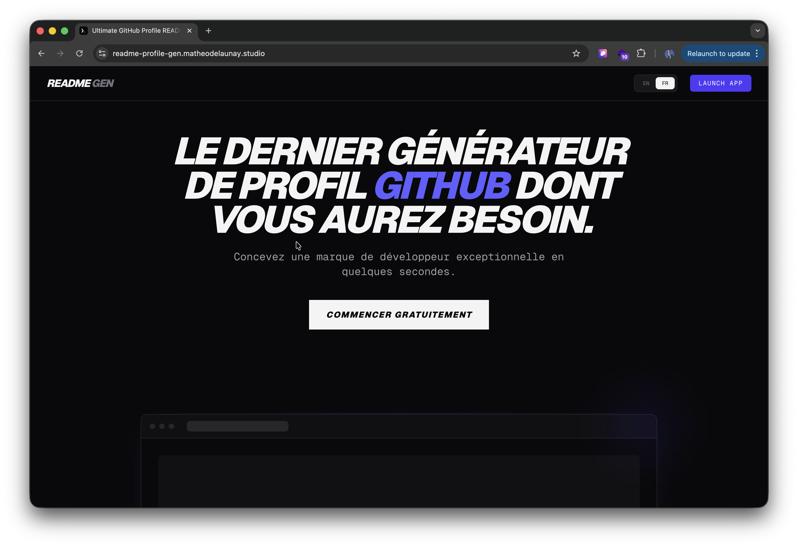
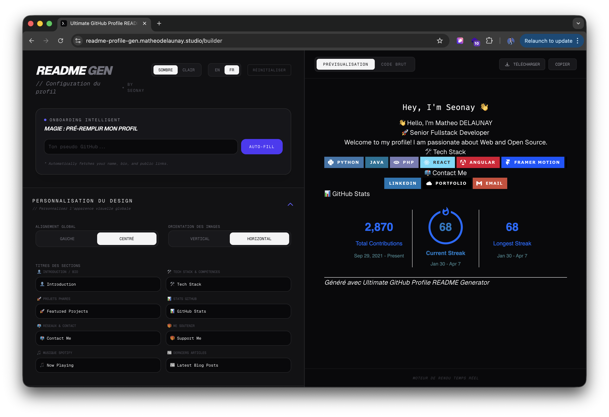

# 🚀 Ultimate GitHub Profile README Generator

<div align="center">


**Build an exceptional GitHub profile in seconds with a modern, fluid, and intelligent interface.**

[Explore the App](#-overview) • [Key Features](#-key-features) • [Quick Start](#-quick-start) • [Contributing](#-contributing)

</div>

---

## ✨ Overview

The **Ultimate README Gen** is more than just a form. It's a high-performance design tool for developers that leverages the GitHub API to provide a "High-Tech Stealth" user experience with real-time feedback and smart automation.

### 🖼️ Previews

#### Landing Page


#### Editor Interface


---

## 🛠 Key Features

### 🪄 Smart Auto-fill (Embedded Intelligence)
Just enter your GitHub username and let the magic happen:
- **Profile & Bio:** Automatically fetch your basic information and public links.
- **Deep Scanning:** Textual analysis of your current README to auto-detect your Tech Stack.
- **Email Extraction:** Smart extraction of your contact address using Regex.

### ↕️ Dynamic Layout & UX
- **Drag & Drop:** Reorder your sections (Bio, Skills, Stats, Projects, etc.) with ease.
- **Smart Layout Manager:** Only manage sections you've actually filled.
- **Interactive Tour:** A guided onboarding for first-time users.
- **Keyboard Shortcuts:** `CMD+S` to download, `CMD+C` to copy, `CMD+K` to search, `CMD+T` for theme.

### 🎨 Total Customization
- **Themes Gallery:** Choose from 10+ themes for your statistics cards.
- **Global Alignment:** Switch between Classic (Left) or Modern (Centered) modes.
- **Badge Factory:** Support for 5 different Shields.io badge styles.
- **Dynamic Typing SVG:** Add animated text with custom fonts, colors, and speeds.

### 📊 Advanced Integrations
- **🐍 Snake Animation:** The famous contribution grid snake.
- **🎵 Spotify Now Playing:** Show what you're listening to in real-time.
- **📰 RSS Feed:** Automatically list your latest blog posts (Medium, Dev.to, etc.).
- **🖼️ Header Banner:** Add a strong visual impact at the top of your profile.
- **📊 GitHub Stats & Trophies:** Comprehensive coding metrics and visual achievements.
- **⏱️ WakaTime:** Weekly coding activity graphs.

### 🛡️ Resilience & Reliability
- **Service Health Check:** Real-time monitoring of third-party APIs.
- **Local Persistence:** Your progress is always saved automatically.
- **CI/CD:** Automated testing and linting via GitHub Actions.

---

## 💻 Tech Stack

| Technology | Usage |
| :--- | :--- |
| **Next.js 16 (App Router)** | High-performance React framework |
| **Zustand** | Global state management & persistence |
| **Tailwind CSS** | Atomic and responsive design system |
| **Framer Motion** | Premium "Stealth" animations |
| **@dnd-kit** | Vertical Drag & Drop engine |
| **Sonner** | Modern toast notifications |
| **Vitest** | Unit testing for the generation engine |

---

## 🚀 Quick Start

1. **Clone the project**
   ```bash
   git clone https://github.com/D-Seonay/readme-profile-gen.git
   cd ultimate-readme-gen
   ```

2. **Install dependencies**
   ```bash
   npm install
   ```

3. **Start the development server**
   ```bash
   npm run dev
   ```
   Open `http://localhost:3000` in your browser!

---

## 📅 Roadmap Progress

- [x] **Phase 1:** Core engine, State Persistence, Multi-language.
- [x] **Phase 2:** Stats, Trophies, WakaTime, Featured Projects.
- [x] **Phase 3:** Snake, Spotify, RSS, Typing SVG, Header Banners.
- [x] **Phase 4:** Premium Landing Page, Onboarding Tour, Shortcuts.
- [ ] **Phase 5:** AI-powered Bio generation (OpenAI/Gemini).
- [ ] **Phase 6:** Community Templates & Theme Sharing.

---

## 🤝 Contributing

Contributions are welcome! 
1. Fork the project.
2. Create your feature branch (`git checkout -b feature/AmazingFeature`).
3. Commit your changes (`git commit -m 'feat: Add some AmazingFeature'`).
4. Push the branch (`git push origin feature/AmazingFeature`).
5. Open a Pull Request.

---

<div align="center">

Developed with ❤️ by [Seonay](https://matheodelaunay.studio)

*Generated with Ultimate GitHub Profile README Generator*

</div>
